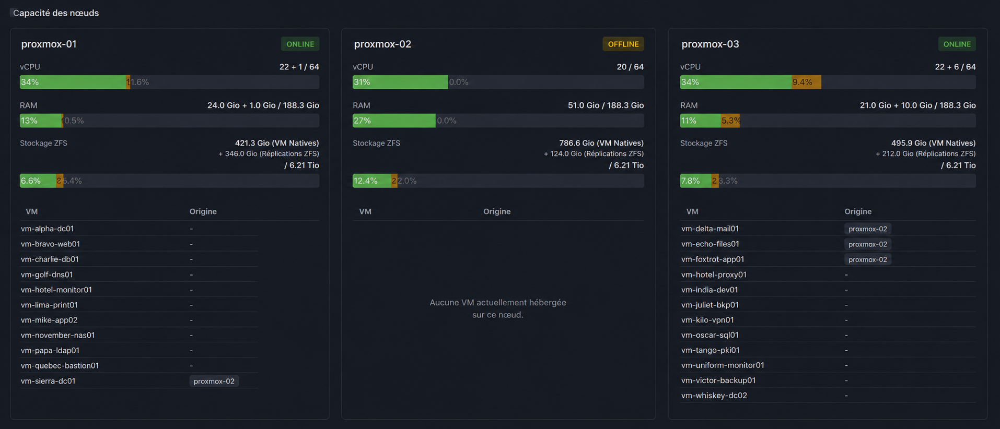
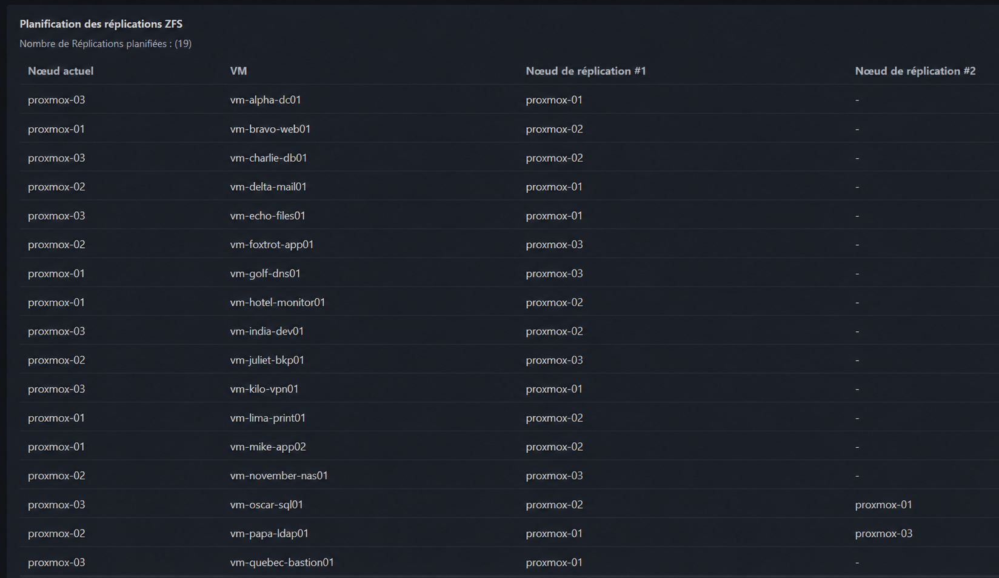

# ClusterLens

<p align="center">
  <strong>HA simulation engine for Proxmox VE</strong>
</p>

<p align="center">
  Supervision, analyse de capacité et simulation de pannes pour clusters Proxmox VE.
</p>

<p align="center">
  
  
  
  
  
  
  
  
</p>

---

## Présentation

**ClusterLens** est un outil de supervision et de simulation conçu pour analyser l'état d'un cluster **Proxmox VE** et anticiper son comportement en cas de panne.

Il collecte les informations directement depuis l'API Proxmox, construit une représentation du cluster et permet notamment de simuler la perte d'un ou plusieurs nœuds afin d'évaluer la capacité du cluster à absorber les machines virtuelles déplacées par la haute disponibilité.

L'objectif est simple :

> **Savoir ce qu'il se passerait avant qu'un nœud tombe réellement.**

ClusterLens ne déclenche aucune migration et ne modifie pas la configuration du cluster.

Les scénarios de panne sont simulés en mémoire à partir de l'état réel de l'infrastructure.

---

## Fonctionnalités

ClusterLens permet actuellement de :

- récupérer l'état des nœuds et des machines virtuelles depuis Proxmox ;
- analyser l'utilisation CPU et RAM du cluster ;
- analyser les capacités de stockage ZFS ;
- récupérer la configuration HA du cluster ;
- prendre en compte les règles HA et les priorités de nœuds ;
- récupérer et analyser les réplications Proxmox ;
- simuler la panne d'un ou plusieurs nœuds ;
- simuler le placement des VM HA sur les nœuds restants ;
- calculer l'impact d'un scénario de panne sur les ressources disponibles ;
- détecter les situations dans lesquelles un scénario HA risque de saturer le cluster ;
- exposer l'état du cluster et les résultats de simulation via une API HTTP ;
- visualiser l'état du cluster et les simulations depuis une interface web.

---

## Aperçu

### Simulation de panne HA

ClusterLens permet de déclarer un ou plusieurs nœuds comme indisponibles et de visualiser le placement simulé des machines virtuelles HA sur les nœuds restants.

L'interface présente l'utilisation des ressources avant et après simulation et permet d'identifier immédiatement l'origine des VM déplacées.



### Réplications ZFS

ClusterLens récupère également la configuration des réplications Proxmox et affiche les destinations de réplication associées aux machines virtuelles.



---

## Prérequis

Pour fonctionner, ClusterLens nécessite :

- **Proxmox Virtual Environment 9.1.4** — version actuellement utilisée et testée avec ClusterLens ;
- Node.js >= 22 pour une installation locale ;
- pnpm pour une installation locale ;
- ou Docker et Docker Compose ;
- un cluster Proxmox VE accessible depuis ClusterLens ;
- un utilisateur Proxmox dédié ;
- un token API Proxmox associé à cet utilisateur ;
- le rôle intégré `PVEAuditor`, attribué au niveau `/` du cluster avec propagation activée.

> **Compatibilité Proxmox VE**
>
> ClusterLens est actuellement développé et testé avec **Proxmox Virtual Environment 9.1.4**.
> D'autres versions de Proxmox VE peuvent fonctionner, mais ne sont pas encore officiellement testées.

---

## Principe de fonctionnement

ClusterLens sépare la collecte des données Proxmox de la logique de simulation.

```text
             Proxmox VE API
                    │
                    ▼
             ProxmoxClient
                    │
                    ▼
             ClusterService
                    │
                    ▼
              Modèle Cluster
                    │
             ┌──────┴──────┐
             ▼             ▼
       HA Simulation    Capacity
          Engine        Simulation
             │             │
             └──────┬──────┘
                    ▼
                HTTP API
                    │
                    ▼
              Web Dashboard
```

Les simulations sont réalisées en mémoire et ne modifient jamais la configuration réelle du cluster Proxmox.

ClusterLens fonctionne donc comme un outil d'analyse **read-only** vis-à-vis de l'infrastructure supervisée.

---

## Architecture du projet

```text
clusterlens-public/
├── dashboard/                 # Interface web
│
├── docs/
│   └── images/
│       ├── ha-simulation.png
│       └── replications.png
│
├── src/
│   ├── clientAPI/             # Communication avec l'API Proxmox
│   ├── config/                # Configuration de l'application
│   ├── interfaces/            # Structures des données brutes Proxmox
│   ├── models/                # Modèle métier du cluster
│   ├── routes/                # Routes HTTP Fastify
│   ├── services/              # Services métier et moteurs de simulation
│   ├── compositionRoot.ts     # Assemblage des dépendances
│   └── main.ts                # Point d'entrée de l'application
│
├── tests/
│   └── units/                 # Tests unitaires
│
├── .dockerignore
├── .env.example
├── .gitignore
├── Dockerfile
├── LICENSE
├── README.md
├── docker-compose.yaml
├── package.json
├── pnpm-lock.yaml
└── tsconfig.json
```

L'application suit une séparation en plusieurs couches :

- **client API** : communication avec l'API Proxmox VE ;
- **interfaces** : représentation des données brutes reçues depuis Proxmox ;
- **modèles** : représentation métier du cluster ;
- **services** : collecte des données, calculs et simulations ;
- **routes** : exposition des fonctionnalités via HTTP ;
- **dashboard** : représentation et interaction côté utilisateur.

---

## Stack technique

| Technologie | Utilisation |
|---|---|
| **Proxmox VE 9.1.4** | Plateforme de virtualisation — version de référence testée |
| **Node.js 22+** | Runtime |
| **TypeScript** | Backend |
| **Fastify** | Serveur HTTP / API |
| **pnpm** | Gestion des dépendances |
| **Proxmox VE API** | Collecte de l'état du cluster |
| **HTML / CSS / JavaScript** | Dashboard |
| **Vitest** | Tests unitaires |
| **Docker** | Déploiement |
---

## Prérequis

Pour fonctionner, ClusterLens nécessite :

- Node.js >= 22 pour une installation locale ;
- pnpm pour une installation locale ;
- ou Docker et Docker Compose ;
- un cluster Proxmox VE accessible depuis ClusterLens ;
- un utilisateur Proxmox dédié ;
- un token API Proxmox associé à cet utilisateur ;
- le rôle intégré `PVEAuditor`, attribué au niveau `/` du cluster avec propagation activée.

Le rôle `PVEAuditor` fournit à ClusterLens les permissions de lecture nécessaires pour récupérer l'état et la configuration du cluster sans lui permettre de modifier l'infrastructure.

ClusterLens est conçu pour fonctionner en **lecture seule** : il ne déclenche aucune migration, modification de configuration ou opération HA sur le cluster Proxmox.

---

## Configuration Proxmox

Il est recommandé de créer un utilisateur spécifiquement destiné à ClusterLens puis de lui attribuer le rôle :

```text
PVEAuditor
```

au niveau :

```text
/
```

avec propagation activée.

Créer ensuite un token API associé à cet utilisateur.

ClusterLens n'a besoin d'aucun privilège d'administration ou de modification du cluster.

---

## Configuration de ClusterLens

Créer le fichier `.env` à partir de l'exemple fourni :

```bash
cp .env.example .env
```

Configurer ensuite la connexion à Proxmox :

```env
PVE_HOST=https://proxmox.example.com:8006
PVE_TOKEN_ID=user@realm!clusterlens
PVE_TOKEN_SECRET=xxxxxxxxxxxxxxxx
PVE_VERIFY_SSL=false

PORT=3000
HOST=0.0.0.0
```

### Variables

| Variable | Description |
|---|---|
| `PVE_HOST` | URL de l'API Proxmox VE |
| `PVE_TOKEN_ID` | Identifiant du token API |
| `PVE_TOKEN_SECRET` | Secret du token API |
| `PVE_VERIFY_SSL` | Active ou désactive la vérification du certificat SSL |
| `PORT` | Port HTTP utilisé par ClusterLens |
| `HOST` | Adresse d'écoute du serveur |

> `PVE_VERIFY_SSL=false` permet notamment d'utiliser ClusterLens avec un certificat Proxmox auto-signé.

Lorsque l'infrastructure utilise un certificat valide, la vérification SSL devrait rester activée.

> **Le fichier `.env` ne doit jamais être versionné.**

---

# Installation

## Docker

Docker est la méthode recommandée pour déployer ClusterLens.

### Cloner le dépôt

```bash
git clone https://github.com/lmeryFulbert/clusterlens-public.git
cd clusterlens-public
```

### Créer la configuration

```bash
cp .env.example .env
```

Modifier ensuite `.env` avec les informations du cluster Proxmox.

### Construire et démarrer ClusterLens

```bash
docker compose up -d --build
```

### Vérifier le conteneur

```bash
docker compose ps
```

### Consulter les logs

```bash
docker compose logs -f
```

ClusterLens est ensuite accessible à l'adresse :

```text
http://<adresse-du-serveur>:3000
```

Le port exposé peut être modifié avec la variable `PORT`.

### Arrêter ClusterLens

```bash
docker compose down
```

### Mettre à jour ClusterLens

```bash
git pull
docker compose up -d --build
```

---

## Installation locale

Pour développer ou exécuter ClusterLens directement avec Node.js :

```bash
git clone https://github.com/lmeryFulbert/clusterlens-public.git
cd clusterlens-public
```

Installer les dépendances :

```bash
pnpm install
```

Créer la configuration :

```bash
cp .env.example .env
```

Puis démarrer l'environnement de développement :

```bash
pnpm dev
```

---

## Build

Compiler le projet TypeScript :

```bash
pnpm build
```

Puis démarrer la version compilée :

```bash
pnpm start
```

---

# API HTTP

ClusterLens expose volontairement une API HTTP simple.

| Méthode | Endpoint | Description |
|---|---|---|
| `GET` | `/state` | Retourne l'état actuel du cluster Proxmox collecté par ClusterLens |
| `GET` | `/simulation` | Exécute une simulation HA à partir de l'état actuel du cluster |

---

## État du cluster

```http
GET /state
```

Cette route retourne l'état courant du cluster construit à partir des informations collectées depuis l'API Proxmox.

Elle est notamment utilisée par le dashboard ClusterLens.

---

## Simulation de panne

```http
GET /simulation
```

Le paramètre optionnel `failedNodes` permet de déclarer un ou plusieurs nœuds comme étant en panne.

### Simulation d'un nœud

```http
GET /simulation?failedNodes=proxmox-01
```

Cette requête simule la perte du nœud `proxmox-01`.

### Simulation de plusieurs nœuds

```http
GET /simulation?failedNodes=proxmox-01,proxmox-02
```

Cette requête simule la perte simultanée des nœuds `proxmox-01` et `proxmox-02`.

### Exemple avec curl

```bash
curl "http://localhost:3000/simulation?failedNodes=proxmox-01"
```

La simulation n'effectue **aucune action sur le cluster Proxmox réel**.

---

# Simulation HA

Lors d'un scénario de panne, ClusterLens détermine notamment :

1. les VM impactées par la panne ;
2. les VM protégées par HA ;
3. les nœuds encore disponibles ;
4. les contraintes définies par les règles HA ;
5. le placement simulé des VM ;
6. la consommation de ressources résultante ;
7. la capacité restante du cluster.

Le moteur peut ainsi être utilisé pour étudier des scénarios de résilience tels qu'une architecture **N+1**.

---

## Analyse de capacité

ClusterLens ne se limite pas à déterminer si une VM dispose d'un nœud de destination.

Le moteur analyse également l'état résultant du cluster afin d'évaluer :

- la RAM utilisée ;
- la RAM disponible ;
- la charge CPU ;
- la capacité de stockage ;
- la répartition des VM ;
- les éventuelles situations de surcharge.

L'objectif est de répondre à une question essentielle lors du dimensionnement d'un cluster :

> **Le cluster peut-il réellement supporter la perte d'un nœud avec sa charge actuelle ?**

---

## Réplications ZFS

ClusterLens collecte les réplications configurées dans Proxmox VE afin de disposer d'une vision de la distribution des données entre les nœuds.

Le dashboard permet notamment de visualiser :

- le nœud hébergeant actuellement la VM ;
- la destination de réplication ;
- une éventuelle seconde destination de réplication ;
- l'espace occupé par les VM natives ;
- l'espace utilisé par les réplications ZFS.

Cette information complète l'analyse de capacité du cluster dans les environnements utilisant du stockage ZFS local.

---

## Tests

ClusterLens utilise **Vitest** pour les tests unitaires.

Exécuter les tests avec :

```bash
pnpm test
```

Les tests sont regroupés dans :

```text
tests/units/
```

Ils permettent notamment de valider les modèles métier, les calculs de ressources et le comportement du moteur de simulation.

---

# Sécurité

ClusterLens est conçu comme un outil d'analyse **read-only**.

Il :

- ne modifie pas la configuration Proxmox ;
- ne déclenche aucune migration réelle ;
- ne démarre ou n'arrête aucune VM ;
- ne déclenche aucune opération HA ;
- effectue les simulations localement ;
- utilise uniquement les informations collectées depuis l'API Proxmox.

Il est recommandé de :

- créer un utilisateur Proxmox dédié ;
- utiliser un token API dédié ;
- attribuer uniquement le rôle `PVEAuditor` ;
- protéger le fichier `.env` ;
- ne jamais exposer le secret du token dans le dashboard ou dans le dépôt Git.

Le dashboard communique avec le backend ClusterLens.

Les identifiants Proxmox restent côté serveur.

---

# Limitations actuelles

ClusterLens est encore en développement.

Les limitations actuelles comprennent notamment :

- fonctionnement sans base de données ;
- état conservé uniquement en mémoire ;
- absence d'historisation des métriques ;
- dépendance à la disponibilité de l'API Proxmox ;
- analyse du stockage principalement orientée ZFS ;
- prise en charge de Ceph non implémentée.

---

# Roadmap

Parmi les évolutions envisagées :

- amélioration du moteur de simulation multi-nœuds ;
- analyse avancée des scénarios N+1 / N+2 ;
- amélioration de la visualisation des simulations ;
- historique des simulations ;
- export de métriques ;
- intégration Grafana ;
- prise en charge de Ceph ;
- recommandations automatiques de dimensionnement.

---

# Auteur

Développé par **Ludovic MERY**, enseignant en BTS SIO au lycée Fulbert de Chartres.

Si vous aimez ClusterLens et souhaitez soutenir son développement, vous pouvez toujours m'offrir une bière. 🍺

Merci également à ChatGPT, qui m'a beaucoup aidé à structurer ce projet, à challenger certains choix techniques et à corriger la syntaxe du code.

Pas d'agent de développement ni de génération autonome du projet : **ClusterLens a été conçu et développé à la main, avec ChatGPT comme outil de réflexion, d'analyse et d'assistance.**

---

# Licence

ClusterLens est distribué sous licence **GNU General Public License v3.0 (GPL-3.0)**.

Voir le fichier [`LICENSE`](LICENSE).

---

<p align="center">
  <strong>ClusterLens</strong><br>
  Know what happens before a node actually fails.
</p>